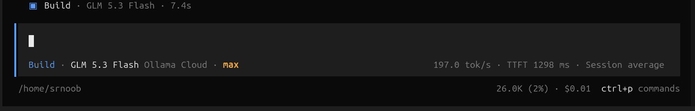
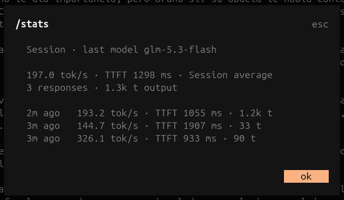
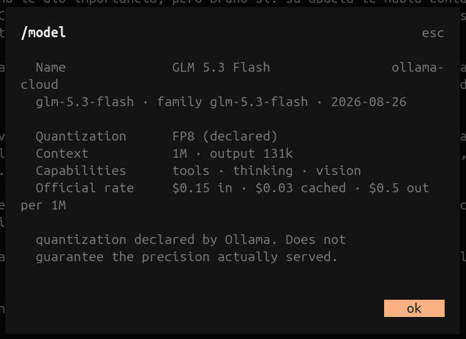

# @srnoob2570/opencode-ollama-cloud

[](https://www.npmjs.com/package/@srnoob2570/opencode-ollama-cloud)
[](https://github.com/srnoob2570/opencode-ollama-cloud/actions/workflows/update.yml)
[](LICENSE)

[Read in English →](README.md)

Plugin de [opencode](https://opencode.ai) que registra el proveedor **Ollama Cloud** con una lista de modelos siempre actualizada, tomada en vivo de `https://ollama.com/v1/models`.

models.dev (la fuente de modelos de opencode) se actualiza manualmente por PR y se queda desactualizado. Este plugin consume un catálogo estático mantenido por GitHub Actions, así que los modelos nuevos aparecen sin esperar a nadie.

> [!NOTE]
> **Transparencia:** este plugin, su actualizador de catálogo y esta documentación fueron generados y son mantenidos con asistencia de IA ([opencode](https://opencode.ai)). Revisa el código antes de confiar en él para algo sensible.

## Inicio rápido

```bash
opencode plugin @srnoob2570/opencode-ollama-cloud --force --global
```

`--force` reemplaza una versión ya instalada. opencode no tiene comando de actualización de plugins, así que repetir este comando es la forma de actualizar. `--global` instala en `~/.config/opencode/opencode.json` en vez de en la config del proyecto.

Eso es todo. Reinicia opencode y verifica:

```bash
opencode models ollama-cloud --refresh
```

Deberías ver la lista live completa (ej. `ollama-cloud/glm-5.3-flash`), incluyendo modelos que models.dev aún no tiene.

```bash
srnoob@MS-7A38:~$ opencode models ollama-cloud --refresh
Models cache refreshed
ollama-cloud/deepseek-v4-flash:0731
ollama-cloud/deepseek-v4-pro:0813
ollama-cloud/gemma4:31b
ollama-cloud/glm-5.1
ollama-cloud/glm-5.2
ollama-cloud/glm-5.3
ollama-cloud/glm-5.3-flash
ollama-cloud/gpt-oss:120b
ollama-cloud/gpt-oss:20b
ollama-cloud/kimi-k2.6
ollama-cloud/kimi-k2.7-code
ollama-cloud/kimi-k3
ollama-cloud/minimax-m2.7
ollama-cloud/minimax-m3
ollama-cloud/mistral-large-3:675b
ollama-cloud/nemotron-3-nano:30b
ollama-cloud/nemotron-3-super
ollama-cloud/nemotron-3-ultra
ollama-cloud/qwen3.5:397b
```

> Asume que ya configuraste tu API key de ollama.com (`opencode auth login` → `ollama-cloud`). Si el proveedor ya estaba registrado, el plugin solo refresca su lista de modelos.

## Cómo funciona

```
ollama.com/v1/models ──┐
                       ├─→ GitHub Action (cada 15 min) ─→ catalog/catalog.json (auto-commit)
ollama.com/library/* ──┘

catalog.json (jsDelivr, purgado tras cada commit / raw.githubusercontent / cache local) ─→ plugin ─→ opencode
```

**Action** (`.github/workflows/update.yml`): corre `bun scripts/update-catalog.ts update` con cron cada 15 minutos. Barato por diseño. El check es 1 GET a `/v1/models`; el scraping solo ocurre si la lista cambió (o una vez por semana, para refrescar los datos de enriquecimiento). El catálogo actualizado se valida (`bun scripts/validate-catalog.ts`) antes de commitear. Peor caso de staleness ≈ 15 min + propagación CDN.

- `check`: compara el hash de `{id, created}` de `/v1/models` contra el catálogo commiteado. Sin scraping.
- `update`: si el hash cambió (o el catálogo tiene más de 7 días), scrapea `ollama.com/library/<base>` (1 request por familia, ~15 requests), enriquece con datos sembrados de models.dev (max output tokens, fechas de release) y escribe `catalog/catalog.json`. Si no cambió, no toca nada. Si un scrape falla y no hay datos previos que conservar, el update aborta en vez de publicar un catálogo degradado.
- `validate`: puerta estructural y de sanidad para `catalog/catalog.json` (la usa CI; corréla localmente tras editar a mano).

**Plugin** (`plugin/index.ts`): hook `config` registra el provider (idempotente) y hook `provider` devuelve los modelos normalizados al schema de opencode, con cascada de fallback:

1. Catálogo remoto (jsDelivr → raw.githubusercontent.com)
2. Cache local en `~/.cache/opencode-ollama-cloud/catalog.json`
3. Passthrough de models.dev (los modelos que opencode ya tiene)

## Instalación manual

¿Prefieres editar la config a mano? Agrega el plugin a `~/.config/opencode/opencode.json`:

```json
{
  "$schema": "https://opencode.ai/config.json",
  "plugin": ["@srnoob2570/opencode-ollama-cloud"]
}
```

### Local (desde un clon de este repo)

```json
{
  "plugin": ["/ruta/a/opencode-ollama-cloud/plugin/index.ts"]
}
```

### Opciones

```json
{
  "plugin": [
    [
      "@srnoob2570/opencode-ollama-cloud",
      { "catalogUrl": "https://mi-cdn/catalog.json" }
    ]
  ]
}
```

- `catalogUrl`: URL alternativa del catálogo (se intenta primero).
- `timeoutMs`: timeout de cada fetch (default `5000`).
- `pricing`: `"on"` (default) o `"off"`. Controla si el contador de costos de opencode muestra la tarifa oficial de Ollama Cloud. `pricing: "reference"` (el valor viejo opt-in) sigue funcionando y significa `"on"`.
- `tui`: `"ensure"` (opt-in, default off). La entrada server registra ella misma la entrada TUI parcheando el tui.json que opencode va a leer (`$OPENCODE_TUI_CONFIG` si está seteado, si no el global). Idempotente, preserva comentarios, surte efecto en el próximo arranque de la TUI. Instalaciones dev (rutas del repo) jamás parchean nada.

```json
{
  "plugin": [["@srnoob2570/opencode-ollama-cloud", { "pricing": "off" }]]
}
```

El catálogo trae la tarifa oficial de Ollama Cloud por modelo: precios de input, cached input y output en USD por 1M de tokens, tomados de la [rate card](https://ollama.com/pricing) pública de Ollama en `catalog/pricing.json`. Es lo que tus créditos pagan de verdad por token, así que el contador de costos de opencode la muestra por defecto (`pricing: "off"` la apaga). Los modelos sin tarifa quedan en $0.

Actualizar la tabla es un workflow manual de GitHub Actions (`.github/workflows/update-pricing.yml`). Disparás `update-pricing` desde la pestaña Actions (o `gh workflow run update-pricing`) y fetcha la rate card viva, imprime un diff tarifa-por-tarifa en el log del run, reescribe `catalog/pricing.json` y commitea el cambio, purgando la caché de jsDelivr para que los usuarios reciban las tarifas nuevas. Si la página y el catálogo no cuadran (un modelo nuevo o retirado), aborta con un reporte y no escribe nada. No hay ningún schedule; las tarifas cambian solo cuando vos disparás el run. El mismo script funciona desde tu máquina (`bun run update-pricing`), y el update automático del catálogo jamás toca el pricing.

## Estadísticas de streaming y ficha de modelo

El plugin mide lo que opencode no guarda: TTFT (tiempo hasta el primer
token) y tokens/s de cada LLM step, del lado del cliente. En `ollama-cloud`
los números tienen precisión de wire porque el plugin envuelve el `fetch` del
provider y lee el chunk final de `usage` que opencode ya pide; para cualquier
otro proveedor los deriva de los eventos de opencode. Muestra el promedio de
la sesión en el lado derecho de la fila del prompt (la fila del nombre del
modelo), una fila arriba de la línea de contexto/costo de opencode. Las
métricas son de la sesión, no del modelo activo: sin desglose por modelo ni
reset al cambiar.



La línea de la derecha es del plugin: `197.0 tok/s · TTFT 1298 ms · Session
average`. El conteo de tokens y el costo que se ven debajo (`26.0K (2%) ·
$0.01`) son el contador propio de opencode, una línea aparte que el plugin no
toca.

- `/stats`. Resumen de sesión y últimas respuestas (detalle por step; las
  filas `wire` y `event` son distinguibles).



- `/model`. Ficha del modelo activo: cuantización, familia, capacidades,
  límites, release y la tarifa oficial (input · cached input · output por 1M;
  salvo `pricing: "off"`).



El promedio solo cuenta el chat principal. Subagentes, titlegen y compaction
jamás entran (señales verificadas contra el código de opencode). Los números
viven en memoria por sesión; no se persiste nada ni sale nada de tu máquina.
La UI de stats es una segunda entrada de plugin y degrada en silencio. En un
build de opencode donde la API TUI cambió, provider/catálogo siguen
funcionando y las stats simplemente desaparecen (probado contra opencode
1.18.27; la API que usa existe pero no está documentada, así que la UI de
stats es best-effort hasta que upstream la documente).

La entrada del provider vive en el array `plugin` de `opencode.json`, como
siempre. La entrada de la TUI va en `tui.json`. Desde opencode 1.18, el host
TUI solo carga sus plugins desde `~/.config/opencode/tui.json` (o el del
proyecto); el array `plugin` de `opencode.json` se ignora en el lado TUI.

Para installs por npm, el comando del CLI registra ambas entradas de una vez
(lee el `main` y `exports["./tui"]` del paquete y parchea ambas configs):

```bash
opencode plugin @srnoob2570/opencode-ollama-cloud
```

Alternativas: setear `tui: "ensure"` en la entrada server (Opciones arriba) y
dejar que el plugin parchee `tui.json` al arrancar, o editar el archivo a mano
como abajo.

opencode.json:

```json
{
  "plugin": [["@srnoob2570/opencode-ollama-cloud", {}]]
}
```

~/.config/opencode/tui.json (una ruta de archivo directa es la forma
verificada; con instalación por npm, apúntala al `tui.tsx` dentro del paquete
instalado):

```json
{
  "$schema": "https://opencode.ai/config.json",
  "plugin": ["/ruta/absoluta/a/opencode-ollama-cloud/plugin/tui.tsx"]
}
```

- `stats`: `"on"` (default) o `"off"`. Ponlo en ambas entradas (forma de
  tupla, p. ej. `["…", { "stats": "off" }]`) y todo se apaga: sin medición,
  sin UI, exactamente el plugin de siempre.

### Auto-actualización

En cada arranque la entrada server hace un lookup al registry de npm. Si hay
release más nueva y el plugin vino instalado por npm con un spec sin fijar,
deja la actualización preparada igual que `@tarquinen/opencode-dcp`. Borra el
wrapper cacheado bajo `~/.cache/opencode/packages/` para que opencode
reinstale la última al siguiente inicio, muestra un toast ("Updated … Restart
opencode to finish.") y la TUI muestra un badge `↑ <versión>` sobre la línea
de stats hasta consumir el update. Installs dev (repo) y specs fijados
(`…@0.1.8`) jamás se tocan. Un lookup fallido se ignora (timeout de 10 s,
fail-silent).

### Cuantización: declarada, no garantizada

La cuantización de la ficha es el valor que Ollama declara para el modelo que
sirve (`file_type` del registry, contrastado con `/api/show`), investigado por
modelo y transportado en el catálogo. No garantiza la precisión a la que corre
realmente la inferencia remota. Los modelos sin fuente pública defendible
muestran `unknown` (nunca se inventan); los modelos fuera del catálogo
muestran `—`.

La idea de las stats de streaming la propuso el usuario de GitHub
[@adilfaisal01](https://github.com/adilfaisal01).

## Desarrollo

```bash
bun install
bun run check           # ¿cambió la lista de modelos? (sin scraping)
bun run update          # regenera catalog/catalog.json si cambió
bun run update --force  # regenera aunque la lista no cambie (enriquecimiento nuevo)
bun run typecheck
```

## Cambios

Cada versión tiene su entrada en [CHANGELOG.md](CHANGELOG.md) (en inglés) y su [release en GitHub](https://github.com/srnoob2570/opencode-ollama-cloud/releases). Las ramas de release están en `release/v*`.

## Licencia

MIT
