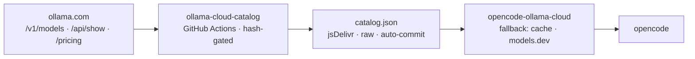

# @srnoob2570/opencode-ollama-cloud

[](https://www.npmjs.com/package/@srnoob2570/opencode-ollama-cloud)
[](https://github.com/srnoob2570/ollama-cloud-catalog/actions)
[](LICENSE)

[Leer en español →](README.es.md)

[opencode](https://opencode.ai) plugin that registers the **Ollama Cloud** provider with an always-up-to-date model list, sourced live from `https://ollama.com/v1/models`.

models.dev (opencode's model source) is updated manually via PRs and goes stale. This plugin consumes a static catalog maintained by GitHub Actions, so new models appear without waiting for anyone.

> [!NOTE]
> **Transparency:** this plugin and this documentation were generated and are maintained with AI assistance ([opencode](https://opencode.ai)). Review the code before trusting it with anything sensitive.

## Quick start

```bash
opencode plugin @srnoob2570/opencode-ollama-cloud --force --global
```

`--force` replaces an already-installed version. opencode has no plugin update command, so re-running this command is how you upgrade. `--global` installs into `~/.config/opencode/opencode.json` instead of a project-local config.

That's it. Restart opencode and check:

```bash
opencode models ollama-cloud --refresh
```

You should see the full live list (e.g. `ollama-cloud/glm-5.3-flash`), including models models.dev doesn't have yet.

```bash
srnoob@MS-7A38:~$ opencode models ollama-cloud --refresh
Models cache refreshed
ollama-cloud/deepseek-v4-flash:0731
ollama-cloud/deepseek-v4-pro:0813
ollama-cloud/gemma4:31b
ollama-cloud/glm-5.1
ollama-cloud/glm-5.2
ollama-cloud/glm-5.3
ollama-cloud/glm-5.3-flash
ollama-cloud/gpt-oss:120b
ollama-cloud/gpt-oss:20b
ollama-cloud/kimi-k2.6
ollama-cloud/kimi-k2.7-code
ollama-cloud/kimi-k3
ollama-cloud/minimax-m2.7
ollama-cloud/minimax-m3
ollama-cloud/mistral-large-3:675b
ollama-cloud/nemotron-3-nano:30b
ollama-cloud/nemotron-3-super
ollama-cloud/nemotron-3-ultra
ollama-cloud/qwen3.5:397b
```

> Assumes you already configured your ollama.com API key (`opencode auth login` → `ollama-cloud`). If the provider was already registered, the plugin just refreshes its model list.

## How it works



**Upstream** ([srnoob2570/ollama-cloud-catalog](https://github.com/srnoob2570/ollama-cloud-catalog)): GitHub Actions build and publish `catalog.json` — a models.dev-shaped document with an `x_ollama` extension. The build is hash-gated on `/v1/models` (a change in `{id, created}` is what triggers a full re-extraction), specs come from Ollama's `/api/show`, and the rate card is parsed with an LLM into each entry's `cost` block. Fail-loud by contract: a scrape failure aborts instead of publishing a degraded catalog.

**Plugin** (`plugin/index.ts`): a `config` hook registers the provider (idempotent) and a `provider` hook returns the models normalized to opencode's schema, with a fallback cascade:

1. Remote catalog (jsDelivr → raw.githubusercontent.com)
2. Local cache at `~/.cache/opencode-ollama-cloud/catalog.json`
3. models.dev passthrough (the models opencode already ships)

## Manual install

Prefer editing the config yourself? Add the plugin to `~/.config/opencode/opencode.json`:

```json
{
  "$schema": "https://opencode.ai/config.json",
  "plugin": ["@srnoob2570/opencode-ollama-cloud"]
}
```

### Local (from a clone of this repo)

```json
{
  "plugin": ["/path/to/opencode-ollama-cloud/plugin/index.ts"]
}
```

### Options

```json
{
  "plugin": [
    [
      "@srnoob2570/opencode-ollama-cloud",
      { "catalogUrl": "https://my-cdn/catalog.json" }
    ]
  ]
}
```

- `catalogUrl`: alternative catalog URL (tried first).
- `timeoutMs`: per-fetch timeout (default `5000`).
- `pricing`: `"on"` (default) or `"off"`. Controls whether opencode's session cost counter shows the official Ollama Cloud rate. `pricing: "reference"` (the old opt-in value) still works and means `"on"`.
- `tui`: `"ensure"` (opt-in, default off). The server entry registers the TUI entry itself by patching the tui.json opencode will read (`$OPENCODE_TUI_CONFIG` when set, else the global one). Idempotent, comment-preserving, effective on the next TUI launch. Dev installs (repo paths) never patch anything.

```json
{
  "plugin": [["@srnoob2570/opencode-ollama-cloud", { "pricing": "off" }]]
}
```

The catalog ships the official Ollama Cloud rate per model: input, cached-input and output prices in USD per 1M tokens, taken from Ollama's public [rate card](https://ollama.com/pricing) into each catalog entry's `cost` block (off-peak rates; peak surcharges stay under `x_ollama.peak_cost`). That is what your credits actually pay per token, so opencode's cost counter shows it by default (`pricing: "off"` turns it off). Models without a rate stay at $0.

Rates are refreshed by the catalog repo's scheduled workflow (weekly, plus manual). If the rate card and the catalog disagree (a new or retired model), the update aborts with a report and writes nothing.

## Streaming stats and the model card

The plugin measures what opencode doesn't: TTFT (time to first token) and tokens/s of every LLM step, client-side. For `ollama-cloud` the numbers are wire-accurate because the plugin wraps the provider's `fetch` and reads the final `usage` chunk opencode already requests; for any other provider it derives them from opencode's events. It shows a live session average on the right side of the prompt row (the row with the model name), one row above opencode's own context/cost line. The metrics belong to the session, not the current model: no per-model breakdown, no reset when you switch models.


The line on the right is the plugin's: `197.0 tok/s · TTFT 1298 ms · Session average`. The token count and cost below it (`26.0K (2%) · $0.01`) are opencode's own counter, a separate line the plugin does not touch.

- `/stats`. Session summary plus the latest responses (step-level detail; `wire` vs `event` rows are distinguishable).


- `/model`. Model card of the active model: quantization, family, capabilities, limits, release date and the official rate (input · cached input · output per 1M; unless `pricing: "off"`).


The average only counts the main conversation. Subagents, title generation and compaction never enter it (measured signals verified against opencode's source). Numbers live in memory per session; nothing is stored and nothing leaves your machine. The stats UI ships as a second plugin entry and degrades silently: on an opencode build where the TUI API moved, the provider and catalog keep working and the stats line simply disappears (tested against opencode 1.18.27; the plugin API it uses exists but is undocumented, so treat the stats UI as best-effort until upstream documents it).

The provider entry stays in `opencode.json`'s `plugin` array as usual. The TUI entry goes in `tui.json`. Since opencode 1.18, the TUI host only loads its plugins from `~/.config/opencode/tui.json` (or the project's); the `plugin` array in `opencode.json` is ignored on the TUI side.

For npm installs, the CLI command registers both entries in one step (it reads this package's `main` and `exports["./tui"]` and patches both configs):

```bash
opencode plugin @srnoob2570/opencode-ollama-cloud
```

Alternatively, set `tui: "ensure"` on the server entry (Options above) and let the plugin patch `tui.json` on boot. Or edit it by hand as below.

opencode.json:

```json
{
  "plugin": [["@srnoob2570/opencode-ollama-cloud", {}]]
}
```

~/.config/opencode/tui.json (a plain file path is the verified form; with an npm install, point it at `tui.tsx` inside the installed package):

```json
{
  "$schema": "https://opencode.ai/config.json",
  "plugin": ["/absolute/path/to/opencode-ollama-cloud/plugin/tui.tsx"]
}
```

- `stats`: `"on"` (default) or `"off"`. Set it on both entries (tuple form, e.g. `["…", { "stats": "off" }]`) and everything turns off: no measurement, no UI, exactly yesterday's plugin.

### Self-update

On every boot the server entry does one npm registry lookup. If a newer release exists and the plugin was installed from npm with an unpinned spec, it stages the update the way `@tarquinen/opencode-dcp` does. It removes the cached wrapper under `~/.cache/opencode/packages/` so opencode reinstalls the latest on the next start, shows a toast ("Updated … Restart opencode to finish."), and the TUI shows an `↑ <version>` badge on the stats line until the update is consumed. Repo (dev) installs and pinned specs (`…@0.1.8`) are never touched. A failed lookup is ignored (10 s timeout, fail-silent).

### Quantization disclosure

The model card's quantization is the value Ollama declares for the model it serves (`/api/show` `quantization_level`), carried in the catalog's `x_ollama` block. It does not guarantee the precision the remote inference actually runs at. Models where Ollama declares nothing say `unknown` (never guessed); models outside the catalog show `—`.

Credit where it's due: the streaming-stats idea was proposed by GitHub user [@adilfaisal01](https://github.com/adilfaisal01).

## Development

The catalog and its updater live in [srnoob2570/ollama-cloud-catalog](https://github.com/srnoob2570/ollama-cloud-catalog). This repo is only the consumer:

```bash
bun install
bun test
bun run typecheck
```

## Changelog

Every version gets an entry in [CHANGELOG.md](CHANGELOG.md) and its own [GitHub release](https://github.com/srnoob2570/opencode-ollama-cloud/releases). Release branches live under `release/v*`.

## License

MIT
